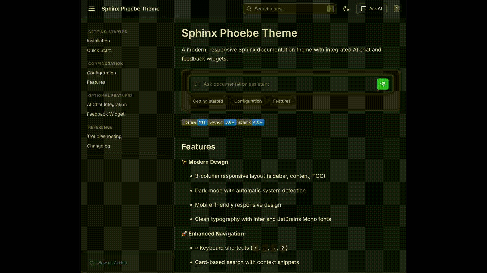

AI Chat Integration
===================

Enable an AI-powered chat widget on your documentation using RunLLM's streaming API.

|

What You Get
------------

When enabled, the chat feature provides:

- **Homepage**: Prominent chat card with suggested prompts
- **Other Pages**: Collapsible sidebar chat panel
- **Context-Aware**: Answers based on your documentation
- **Conversation History**: Saved locally in the browser
- **Real-Time Streaming**: Responses stream as they're generated

Prerequisites
-------------

1. **RunLLM Account**: Sign up at https://runllm.com/
2. **API Credentials**: You'll need an API key and pipeline ID
3. **Environment Variables**: Store credentials securely (never commit!)

Step 1: Get RunLLM Credentials
-------------------------------

Sign Up and Create Pipeline
~~~~~~~~~~~~~~~~~~~~~~~~~~~~

1. Go to https://runllm.com/ and create an account
2. Click "Create Pipeline" or "New Project"
3. Configure your pipeline:

   - **Name**: Your project name (e.g., "My Project Docs")
   - **Documentation Source**: Your docs URL or GitHub repo
   - **Settings**: Configure AI behavior and context

4. After creating the pipeline, you'll receive:

   - **API Key**: Looks like ``llm_xxxxxxxxxxxxx``
   - **Pipeline ID**: A numeric ID like ``123``

Keep Credentials Safe
~~~~~~~~~~~~~~~~~~~~~

.. danger::

   **CRITICAL SECURITY WARNING**

   **NEVER** commit API keys to git repositories! Always use environment variables.

Step 2: Set Environment Variables
----------------------------------

For Local Development
~~~~~~~~~~~~~~~~~~~~~

Create a ``.env`` file in your project root (**add to .gitignore!**):

.. code-block:: bash

   # .env (DO NOT COMMIT THIS FILE!)
   RUNLLM_API_KEY=llm_xxxxxxxxxxxxxxxxxxxxx
   RUNLLM_PIPELINE_ID=123

Load them in your shell:

.. code-block:: bash

   # Option 1: Export manually
   export RUNLLM_API_KEY="llm_xxxxxxxxxxxxxxxxxxxxx"
   export RUNLLM_PIPELINE_ID="123"

   # Then build your docs
   make html

For CI/CD
~~~~~~~~~

**GitHub Actions:**

.. code-block:: yaml

   # .github/workflows/docs.yml
   env:
     RUNLLM_API_KEY: ${{ secrets.RUNLLM_API_KEY }}
     RUNLLM_PIPELINE_ID: ${{ secrets.RUNLLM_PIPELINE_ID }}

Add secrets in: Settings → Secrets and variables → Actions

**GitLab CI:**

.. code-block:: yaml

   # .gitlab-ci.yml
   variables:
     RUNLLM_API_KEY: $RUNLLM_API_KEY  # Set in Settings
     RUNLLM_PIPELINE_ID: $RUNLLM_PIPELINE_ID

Step 3: Configure Your Theme
-----------------------------

Update your ``conf.py``:

.. code-block:: python

   import os

   html_theme = 'sphinx_phoebe_theme'

   html_theme_options = {
       # ... other options ...

       # Enable chat
       "chat_enabled": True,

       # Load credentials from environment variables
       "chat_api_key": os.getenv("RUNLLM_API_KEY"),
       "chat_pipeline_id": int(os.getenv("RUNLLM_PIPELINE_ID", "0")),

       # Provider (only 'runllm' is supported currently)
       "chat_provider": "runllm",
   }

Conditional Enabling
~~~~~~~~~~~~~~~~~~~~

Only enable chat if credentials are available:

.. code-block:: python

   import os

   # Enable chat only if credentials are set
   chat_api_key = os.getenv("RUNLLM_API_KEY")
   chat_pipeline_id = os.getenv("RUNLLM_PIPELINE_ID")

   html_theme_options = {
       "chat_enabled": bool(chat_api_key and chat_pipeline_id),
       "chat_api_key": chat_api_key,
       "chat_pipeline_id": int(chat_pipeline_id or "0"),
   }

Step 4: Build and Test
-----------------------

Build Your Documentation
~~~~~~~~~~~~~~~~~~~~~~~~

.. code-block:: bash

   # Make sure environment variables are set
   echo $RUNLLM_API_KEY    # Should show your key
   echo $RUNLLM_PIPELINE_ID  # Should show your ID

   # Build
   make html

Test Locally
~~~~~~~~~~~~

.. code-block:: bash

   cd _build/html
   python -m http.server 8000

Open http://localhost:8000 and you should see:

1. **Header**: "Ask AI" button in the top navigation
2. **Homepage**: Chat card with suggested prompts
3. **Other Pages**: Chat panel on the right (click "Ask AI" to open)

Troubleshooting
---------------

Chat Button Not Showing
~~~~~~~~~~~~~~~~~~~~~~~~

**Problem**: The "Ask AI" button doesn't appear.

**Solutions**:

1. Check that ``chat_enabled`` is set to ``True``
2. Verify environment variables are loaded:

   .. code-block:: bash

      python -c "import os; print('API Key:', os.getenv('RUNLLM_API_KEY'))"

3. Rebuild your docs after setting environment variables

Console Shows "Chat disabled"
~~~~~~~~~~~~~~~~~~~~~~~~~~~~~~

This is expected if credentials aren't configured. It's a security feature - the chat widget won't load without valid credentials.

Chat Widget Doesn't Respond
~~~~~~~~~~~~~~~~~~~~~~~~~~~~

**Possible Causes**:

1. **Invalid API Key**: Double-check your API key is correct
2. **Wrong Pipeline ID**: Verify the pipeline ID matches RunLLM dashboard
3. **Network Issues**: Check browser console for API errors
4. **CORS Issues**: Use an HTTP server, not ``file://`` URLs

**Check Browser Console**:

Press F12 → Console tab. Look for errors starting with "RunLLM" or "fetch".

Security Best Practices
-----------------------

✅ DO
~~~~~

- **Use environment variables** for all credentials
- **Add .env to .gitignore**
- **Use different keys** for development vs. production
- **Rotate keys periodically**
- **Monitor API usage** in RunLLM dashboard

❌ DON'T
~~~~~~~~

- **Never commit API keys** to version control
- **Don't hardcode credentials** in ``conf.py``
- **Don't share keys** in documentation or examples
- **Don't expose keys** in build logs or CI output
- **Don't use production keys** for development

Example .gitignore
~~~~~~~~~~~~~~~~~~

.. code-block:: text

   # Environment variables (NEVER COMMIT!)
   .env
   .env.local
   .env.production

   # Sphinx build output
   _build/

Costs
-----

RunLLM pricing varies by plan. Check https://runllm.com/pricing for current rates.

Alternative: Disable Chat
--------------------------

If you don't want the chat feature, simply set or omit ``chat_enabled``:

.. code-block:: python

   html_theme_options = {
       "chat_enabled": False,  # Or just omit this line
   }

The theme works perfectly without the chat feature!

Support
-------

- **RunLLM Documentation**: https://docs.runllm.com/
- **RunLLM Support**: support@runllm.com
- **Theme Issues**: https://github.com/justineheritage/sphinx-phoebe-theme/issues
